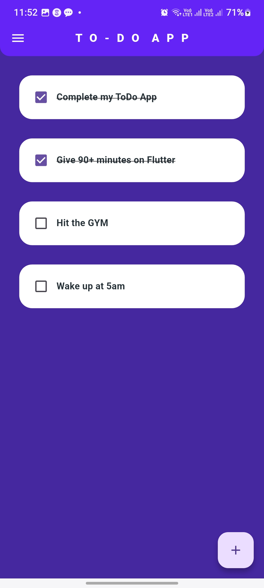
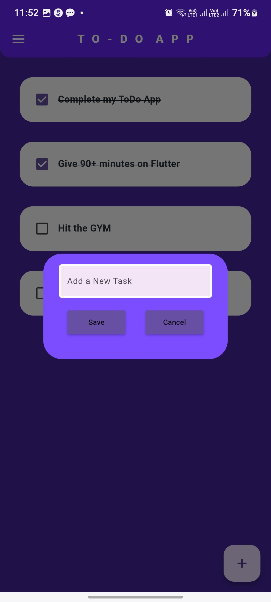
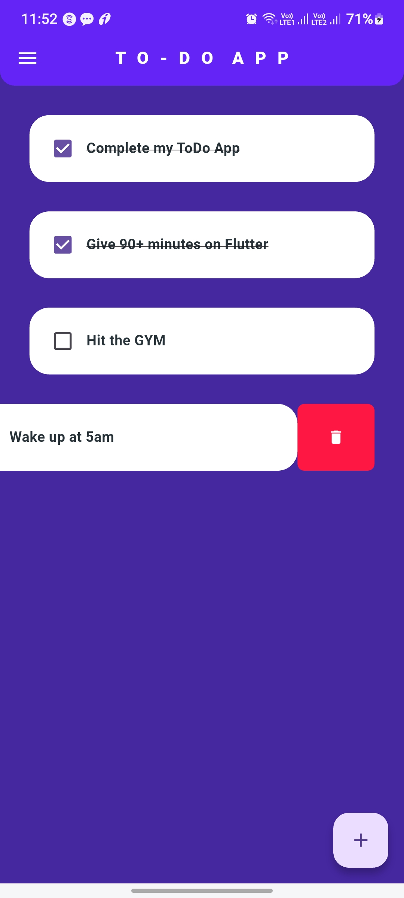

# ✅ To Do App in Flutter

A sleek, minimalist **Todo App** built with Flutter. This app allows users to easily add, manage, and complete their daily tasks – all within a clean and intuitive interface. Whether you're a developer looking to explore Flutter or just need a smart way to track your day, this app has you covered.

---

## 🚀 Features

- ✍️ Add new todos quickly
- ✅ Mark tasks as completed
- 🗑️ Delete tasks with a single tap
- 💾 Persistent local storage (your tasks are saved even after restarting)
- 📱 Responsive UI for all devices

---

## 📸 Screenshots

### 🏠 Home Screen


### ➕ Add Task


### ✅ Completed Task



---

## 🛠️ Tech Stack

- **Flutter** (Frontend)
- **Dart** (Logic)
- **SharedPreferences** (Local Storage)

---

## 📦 Installation

1. **Clone the repo**
   ```bash
   git clone https://github.com/your-username/todo_app_flutter.git
   cd todo_app_flutter
   ```

2. **Get dependencies**
   ```
   flutter pub get
   ```

3. **Run the app**
   ```
   flutter run
   ```

---

## ✨ Coming Soon
🔔 Notifications
⏰ Due dates
🎨 Dark mode
🔄 Cloud sync (Firebase)

---

## 🙌 Contributing
Pull requests are welcome! For major changes, please open an issue first to discuss what you would like to change.

---

## 📫 Contact
Feel free to connect with me on [](https://www.linkedin.com/in/pragyan-dhar-b98696313/) or shoot an email at pragyanchandradhar7@gmail.com.

---

Let me know if you want to add:
- Firebase login
- Tagline with your Monk Mode transformation
- A GIF demo instead of screenshots
